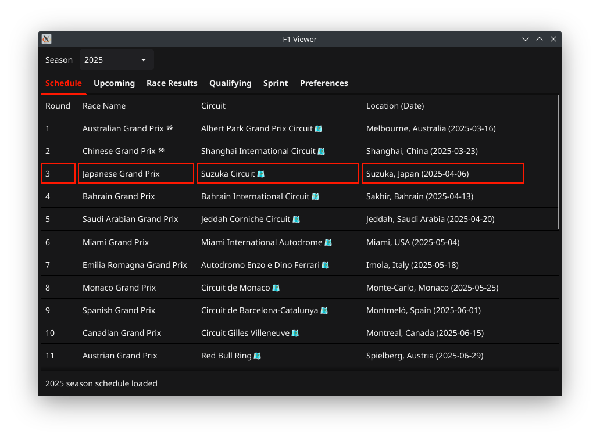
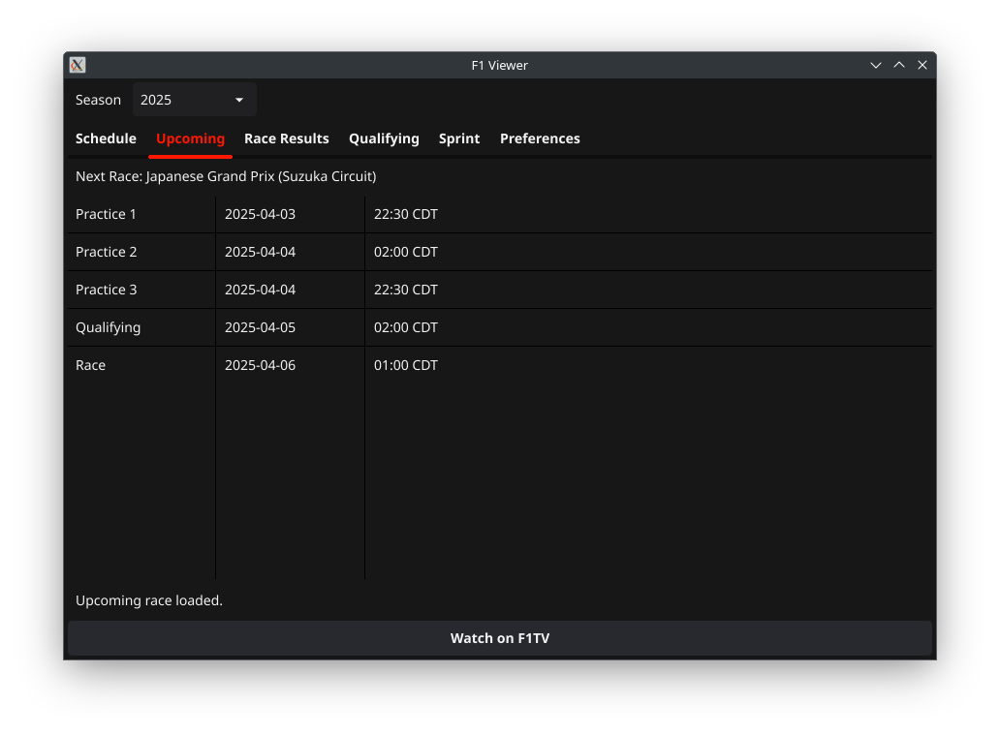
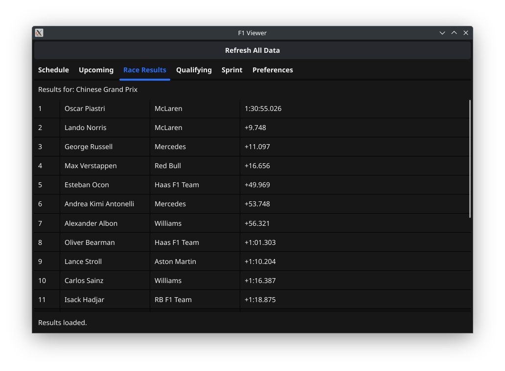
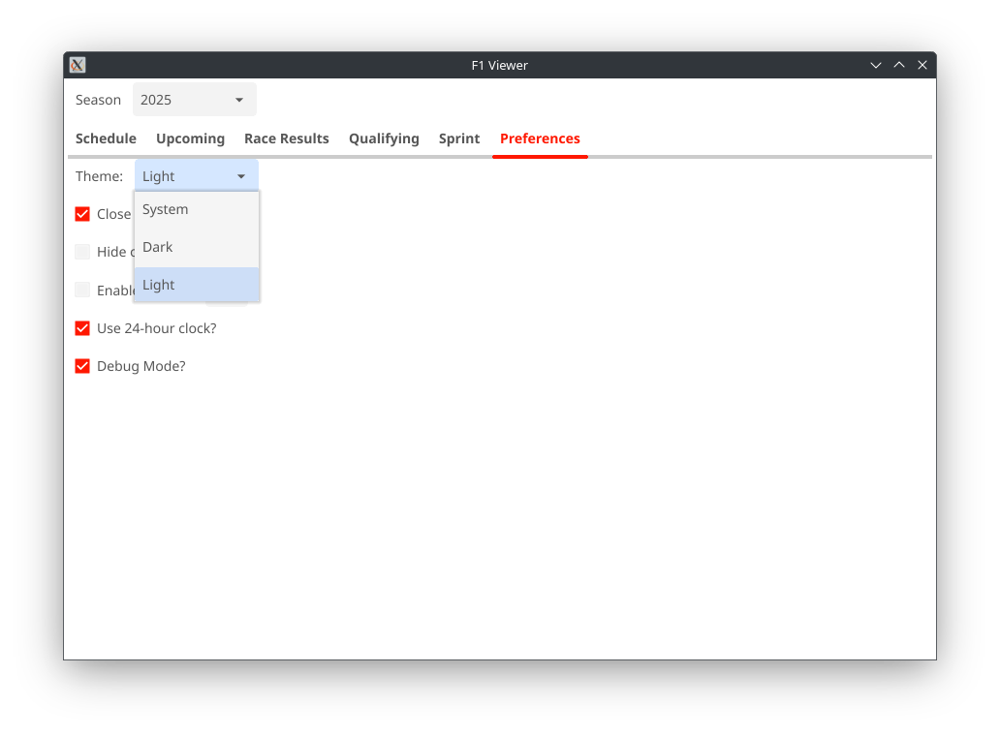

# F1Tray

F1Tray is a desktop application that provides Formula 1 enthusiasts with up-to-date race schedules and results — and now historical data too.  

Built using the [Fyne](https://fyne.io/) toolkit and powered by the [Jolpica](https://jolpica.com/) API, it offers a sleek and intuitive interface for accessing F1 data directly from your system tray.

## Features

- **Race Schedule**: Fetches the current season's race calendar, highlighting the next upcoming race.
- **Historical Race Results**: Instantly view results, qualifying, and sprint data from **any past F1 race** — just double-click a race name in the Schedule tab.
- **Race Results**: View the latest Grand Prix outcomes in a clean, readable table format.
- **Interactive Circuits**: Double-click any circuit name to open its location on an interactive OpenStreetMap.
- **Watch on F1TV**: If you’re a subscriber, one click takes you directly to F1TV to stream sessions.
- **Cross-Platform**: Runs on Windows, macOS, and Linux.
- **System Tray Integration**: Quickly access key features from the tray icon.
- **Lightweight and Fast**: Optimized for minimal resource usage with efficient background data updates.

## Screenshots

### 🗓️ Race Schedule Tab  
Highlights the current F1 calendar and lets you double-click race names for historical results or circuits for maps.

---

### ⏱️ Upcoming Sessions Tab  
Shows upcoming practice, qualifying, sprint, and race times — with a shortcut to F1TV.

---

### 🏁 Results Tab  
Displays official race results in a simple, scrollable table. Now supports historical rounds.

---

### 🌞 Light Theme  
F1Tray now supports a Light Theme, offering a bright, modern interface for users who prefer a lighter user experience.

---

## TODO
- ???

## Legal Notice

This project is not affiliated with, endorsed by, or associated with Formula One Group or any of its subsidiaries.  
The Formula 1 logo and name are trademarks of Formula One Licensing BV.  
All trademarks and copyrights belong to their respective owners.

Any use of the F1 name or logo is for educational or placeholder purposes only and will be removed in any public or production release.
