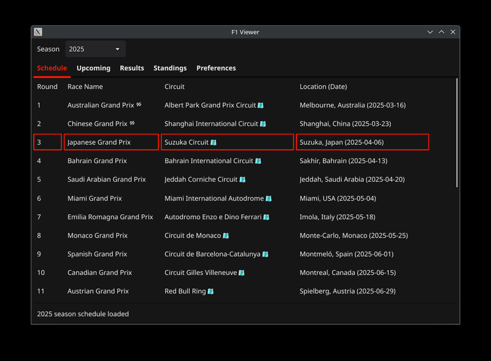

# F1Tray

**F1Tray** is a minimal, cross-platform desktop tray application that shows live and upcoming Formula 1 session information. It features quick access to race results, qualifying times, championship standings, and weekend schedules—right from your system tray.

---

## Features

### 🏁 Upcoming Sessions at a Glance
See a list of upcoming F1 sessions with the current session highlighted in real-time.

- Session start times adjusted to your local time zone.
- Highlights any session that is currently in progress.
- Support for session notifications based on your preferences.

### 🏆 Race Results & Qualifying
Quickly check the final standings for races, sprints, and qualifying rounds.

- Driver positions, time gaps, and status.
- Differentiates between Race, Sprint, Qualifying, and Sprint Qualifying.

### 🧮 Driver & Constructor Standings
Stay up-to-date on the championship battle.

- Full season standings for drivers and constructors.
- Highlights current leaders and team points.
- Auto-updates after each race.

### 🔔 Custom Notifications
Receive notifications at the start of each session, or configure alerts for minutes/hours beforehand.

- Configurable for each session type (e.g., Practice, Qualifying, Race).
- Integrates cleanly with your desktop notification system.

### 🎨 Theming & UI
F1Tray offers both light and dark themes to match your desktop environment.

---

## 📸 Screenshots

  

  <em>Schedule, sessions, results, standings, notifications, and theming – all at a glance.</em>

> 💡 More screenshots available in the [`screenshots`](./screenshots) folder.

---

## Design Highlights

- Built with [Fyne](https://fyne.io/) for a native look and feel.
- Uses data from the [Jolpica API](https://github.com/jolpica/api) (Apache 2.0).
- Auto-refreshes data in the background.
- Configurable options include light/dark theme, session alert timing, and window behavior on close.

---

## License

This project is licensed under the [Prosperity Public License 3.0.0](LICENSE).  
You may use this software for **noncommercial purposes** only.

Third-party licenses:

- [Fyne (BSD 3-Clause)](third_party_licenses/fyne_LICENSE.txt)  
- [Jolpica API (Apache 2.0)](third_party_licenses/jolpica_LICENSE.txt)
