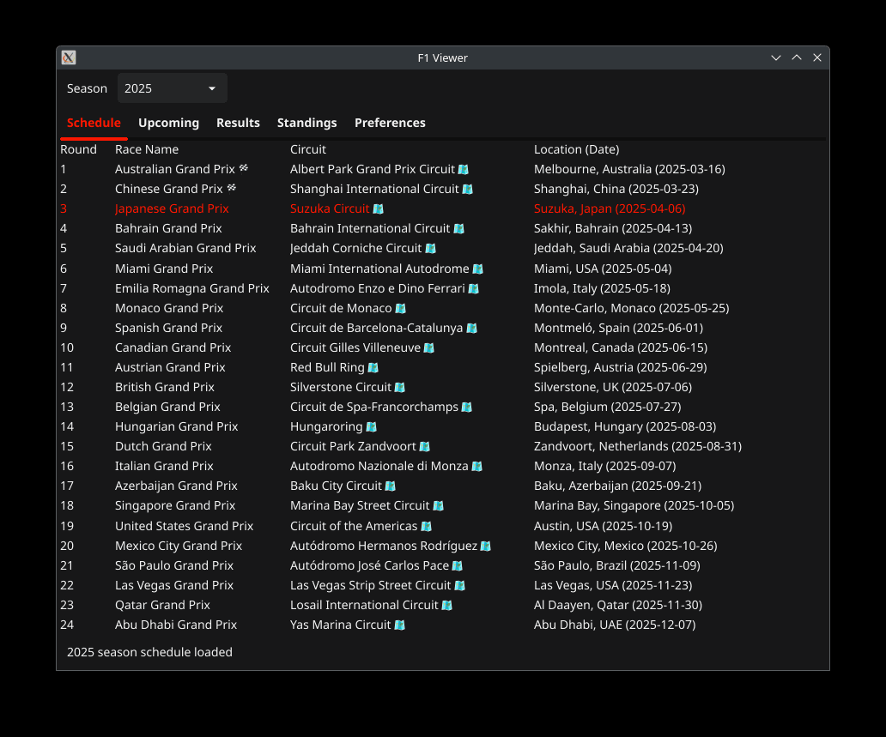

# F1Tray (Archived)

> ⚠️ **Note:** This project is no longer maintained.  
> It was an experimental exploration of using AI-assisted development to build a cross-platform desktop tray application.

For the actively developed successor, check out [`f1viewer`](https://github.com/mphartzheim/f1viewer) – a faster, cleaner, and more extensible project for browsing Formula 1 data in real time.

---

## Overview

**F1Tray** is a minimal, cross-platform desktop tray application that shows live and upcoming Formula 1 session information. It features quick access to race results, qualifying times, championship standings, and weekend schedules—right from your system tray.

---

## Features

### 🏁 Upcoming Sessions at a Glance
- Localized session start times.
- Real-time session highlighting.
- Notification support.

### 🏆 Race Results & Qualifying
- Final standings with driver positions and time gaps.
- Differentiates session types clearly.

### 🧮 Driver & Constructor Standings
- Full season rankings.
- Highlights leaders and points.

### 🔔 Custom Notifications
- Per-session configurable alerts.
- Desktop integration.

### 🎨 Theming & UI
- Light and dark themes supported.

---

## 📸 Screenshots

  

  <em>Schedule, sessions, results, standings, notifications, and theming – all at a glance.</em>

> 💡 More screenshots available in the [`screenshots`](./screenshots) folder.

---

## Design Highlights

- Built with [Fyne](https://fyne.io/) for a native desktop look.
- Uses data from the [Jolpica API](https://github.com/jolpica/api) (Apache 2.0).
- Background data refresh.
- User-configurable options for appearance and behavior.

---

## License

This project is licensed under the [Prosperity Public License 3.0.0](LICENSE).  
You may use this software for **noncommercial purposes** only.

Third-party licenses:

- [Fyne (BSD 3-Clause)](third_party_licenses/fyne_LICENSE.txt)  
- [Jolpica API (Apache 2.0)](third_party_licenses/jolpica_LICENSE.txt)
